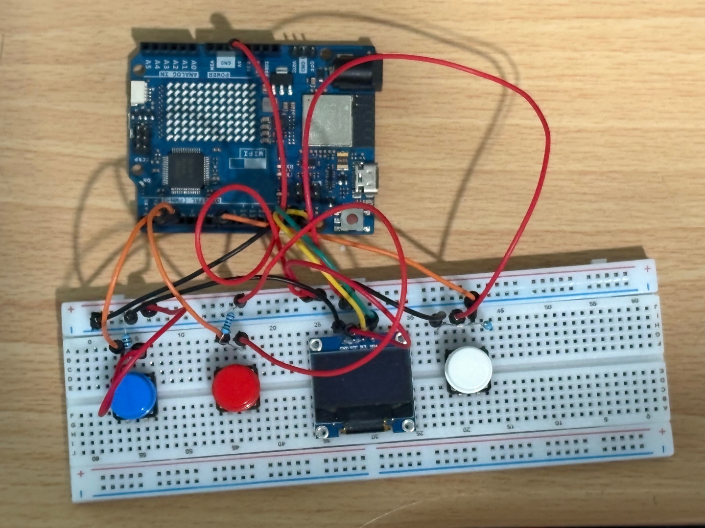

# MU Machine V1
An Arduino Uno R4 game console featuring three fully playable games (Flappy Bird, Ping-Pong, Turn Based RPG Game). 

## List of Hardware Required
- Arduino Uno R4 Board
- 0.96 inch OLED Display Module
- 3 Buttons
- 3 Resistors

## Wiring Example

